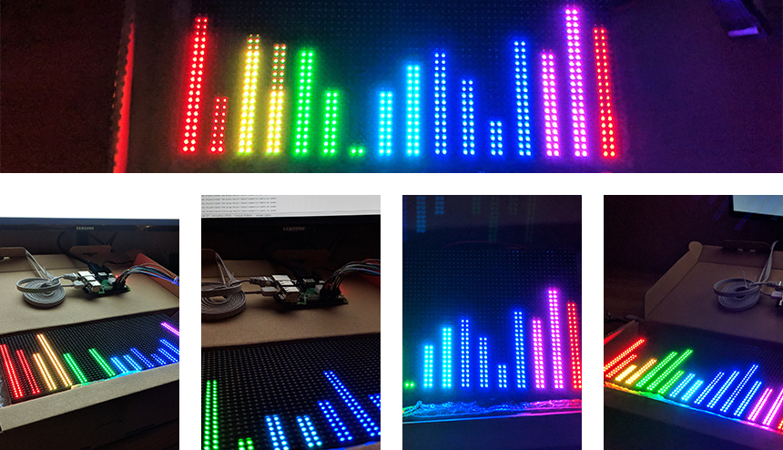

### Audio Visualizer for Arduino  
***Contributors:*** *Thomas Kou, Hansson Lin*

An audio visualization program and our SE 101 term project. For use with Raspberry Pi and
programmed in Python 3.6 using PyCharm. Able to display both `.wav` audio files and audio
from microphone input.

The `src` folder contains code that runs on a computer, decoding audio signals and
sending them to an external MQTT server. The `raspberry` folder contains a script
`Lights.py` that runs on the Raspberry Pi, which is responsible for receiving messages
from the MQTT server and displaying them on an attached 32x64 LED board.

***

***

#### Usage

***Raspberry Pi initialization:***  
* With an internet connection and with superuser privileges, run `raspberry/Lights.py`
through the terminal with the arguments `--led-rows=32 --led-cols=64 --led-pwm-bits 1
--led-slowdown-gpio 2 --led-no-hardware-pulse LED-NO-HARDWARE-PULSE`.

***WAV playback from a computer:***  
* Place a `.wav` file in the `audio` folder. In `src/Main.py`, set `INPUT` to false and set
the `FILE` variable to the target file path relative to the `audio` folder. Then, run
`src/Main.py`.

***Microphone input from a computer:***
* In `src/Main.py`, set `INPUT` to true. Set `TIMED` to either true or false depending on
whether timed or indefinite microphone input is desired. If timed, also set `SECONDS` to the
desired duration. Then, run `src/Main.py`.

***

#### Libraries used

* Computer: `numpy`,  `pyaudio`, `wave`, and `paho-mqtt`.

* Raspberry Pi: `paho-mqtt` and `rgbmatrix`.

* `matplotlib` and `tkinter` are optional and used only for testing purposes. If needed,
these can be commented out.

***

#### Additional credits

The file `raspberry/SampleBase.py` is sourced from the `rpi-rgb-led-matrix` repository and
used under the GPL v3.0 license. Credits go to *hzeller* and the other contributors of the
repository.